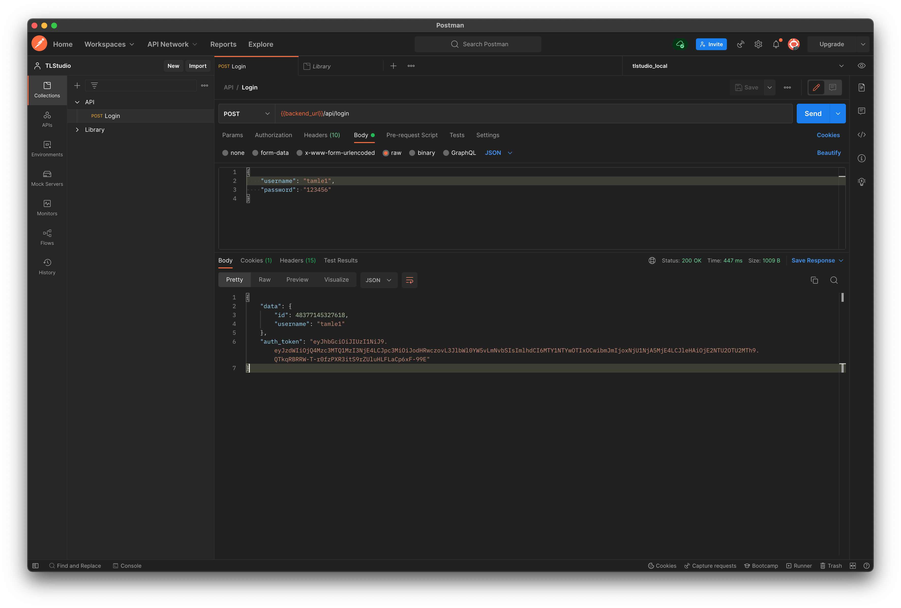

# Overview
This web application will shorten your URL.

# System Dependencies
- Ruby 3.0.2
- Rails 6.1.4
- PostgreSQL
# Setup & Configuration
## Docker
1. Clone project
```sh
git clone git@github.com:tamle-dev/shorten-url.git
```
2. Duplicate .env from .env.example
3. Make sure `DB_USER` and `DB_PASSWORD` in docker-compose.yml and .env are the same
4. Build image
```sh
docker build . -t tamle:lastest
```
5. Compose container
```sh
docker-compose up -d
```
6. Access http://localhost:3000
## Manual
1. Install PostgreSQL
```sh
brew install postgresql
```
2. Install Ruby 3.0.2 (recommend use rvm)
3. Clone project
```sh
git clone git@github.com:tamle-dev/shorten-url.git
```
4. Duplicate .env from .env.example
5. Install dependencies
```sh
bundle install
```
6. Create database
```sh
rake db:create
```
7. Migrations and Seed data
```sh
rake db:migrate
rake db:seed
```
8. Start application
```sh
rails c
```
9. Access http://localhost:3000
# API
Note: All API (except login API) must have Authorization header with auth_token which has been generated in login API
1. Login with email & password
```sh
POST api/users/login
```
2. Shorten URL
```sh
POST api/links/shorten
```
3. Get links
```sh
GET api/links
```
4. Get link details
```sh
GET api/links/:slug
```
# How to use
1. Access http://localhost:3000
2. Sign in / Sign up
3. Create link with long URL
4. View list of links
5. View link details with shortend url
# UI


# API



